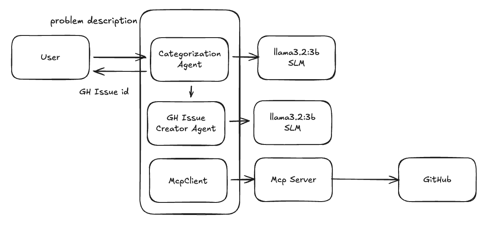

### Github Issue Creator 

## input: Given an issue description the model categorizes them as below
- New Feature
- Bug Fix
- Security Fix
- Infra Change
- Document Change
- Unknown

## We have 5 engineers to work on. Assign a developer 
- Dev1 ... Dev 5
- Dev3 is the infra engineering and all infra issues must only be assigned to him

### This is the multi model multi agent project using langchain
- This is a demo project to show the use cases for SLM and LLM 
- Demonstrate the tools , mcp clients and mcp servers

## Models used
- Gemma3:270m use for categorization 
- gpt-4.1-nano used for github issue creation template with some documents to refer about the issue 

### MCP 

- Mcp has tools to maintain the developer list 
- Mcp has tools has access to github api to crete issues

## Block Diagram

